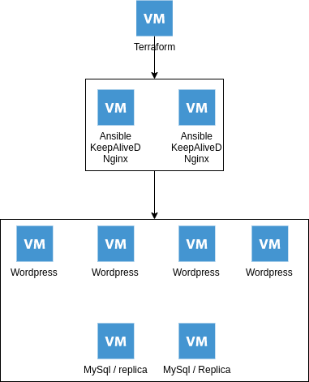

# Synthèse du projet Open Source !

Bonjour à vous,
Ici, vous trouverez une petite synthèse du projet que l'on souhaite réaliser pour le cours d'Open Source :-)

## Le projet
Le début de notre projet commence avec **Vagrant**.
Via un **Vagrantfile**, Nous allons lancer deux machines virtuelles. 
Ces machines virtuelles seront pré-configurées et seront lancées au choix de l'utilisateurs final sous Azure ou en local.
Les deux premières VM auront des services pré installer et pré-configurer, 
A savoir :

 - **ansible**
 - **keepalived**
 - **Nginx**

Il y aura ensuite un ensemble de 4 VM qui pourront être étendu a un plus grand nombre si besoin, pour les besoins du projet nous avons choisis d'y héberger un wordpress sur chacune d'entre elle.

Pour pouvoir herberger de la données sur ces 4 VM il y aura aussi deux instances avec **MySql** d'installer et les bases de données nécessaires.

Ces deux instances auront aussi **KeepAlived**  d'installer pour pouvoir gérer la *disponibilité* et le *load-balancing*.
Un système de **réplica** sera également mis en place sur ces instances pour *garantir les données* sur toutes les machines.

Ci dessous un schéma récapitulant les différents services sur chaque Vm

## Schéma 
Voici un schéma récapitulant notre architecture :  

